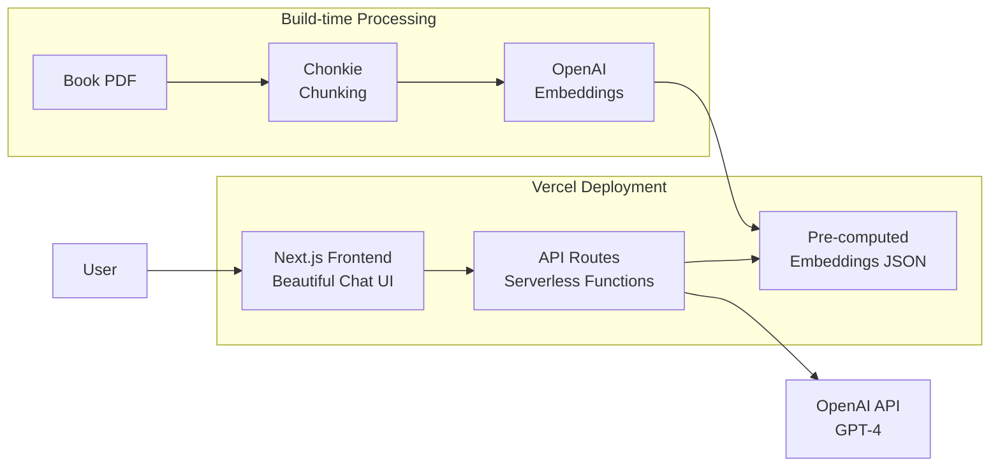

# My 4 Blocks - RAG Chat Experience

## Architecture Overview



## Key Decisions

**ChromaDB + Serverless Consideration**: Since Vercel functions are stateless, we'll pre-compute all embeddings at build time and store them in a JSON file. This gives us:
- Zero cold-start latency for vector search
- No external DB dependency
- Simple deployment (everything in one repo)
- For the book size (~80 pages), in-memory similarity search is fast enough

**The Four Blocks Framework**: The chat will be grounded in:
1. Anger - The Formula and cure
2. Anxiety - The Formula and cure  
3. Depression - The Formula and cure
4. Guilt - The Formula and cure
5. The ABCs of emotion creation (Albert Ellis REBT)
6. The Seven Irrational Beliefs
7. Zen/Mindfulness practices

---

## Phase 1: Content Processing Pipeline

### 1.1 Create Python script for one-time processing

Location: `scripts/process_book.py`

- Use Chonkie library to intelligently chunk the PDF
- Generate embeddings via OpenAI `text-embedding-3-small`
- Add metadata: chapter, section, topic (Anger/Anxiety/Depression/Guilt)
- Export to `data/embeddings.json`

### 1.2 Chunk Strategy

```python
# Chunk configuration optimized for therapeutic content
chunk_config = {
    "chunk_size": 500,        # tokens - good for context windows
    "chunk_overlap": 50,      # maintain continuity
    "metadata_fields": ["chapter", "section", "block_type"]
}
```

---

## Phase 2: Next.js Application

### 2.1 Project Structure

```
my-4-blocks/
├── app/
│   ├── page.tsx              # Landing with suggested prompts
│   ├── chat/
│   │   └── page.tsx          # Main chat interface
│   ├── api/
│   │   └── chat/
│   │       └── route.ts      # RAG + OpenAI endpoint
│   └── layout.tsx
├── components/
│   ├── ChatInterface.tsx     # Beautiful chat UI
│   ├── SuggestedPrompts.tsx  # Initial prompt cards
│   ├── MessageBubble.tsx     # Styled messages
│   └── BlocksIndicator.tsx   # Shows which "block" is relevant
├── lib/
│   ├── vectorSearch.ts       # In-memory similarity search
│   ├── openai.ts             # OpenAI client
│   └── prompts.ts            # System prompts for RAG
├── data/
│   └── embeddings.json       # Pre-computed chunks + vectors
└── scripts/
    └── process_book.py       # One-time processing script
```

### 2.2 Beautiful UI Design

Inspired by the book's themes (Zen, peace, mindfulness):

- **Color palette**: Calming blues, soft whites, gentle gradients
- **Typography**: Clean, readable serif for content; modern sans for UI
- **Animations**: Subtle, peaceful transitions (Framer Motion)
- **The Four Blocks**: Visual representation showing Anger, Anxiety, Depression, Guilt as interconnected blocks
- **Chat bubbles**: Glass-morphism effect, gentle shadows
- **Suggested prompts**: Card-based layout with icons for each emotional block

### 2.3 Suggested Initial Prompts

```typescript
const suggestedPrompts = [
  { icon: "flame", block: "Anger", 
    prompt: "How do I stop getting angry at things I can't control?" },
  { icon: "cloud", block: "Anxiety", 
    prompt: "What's the formula for understanding my anxiety?" },
  { icon: "moon", block: "Depression", 
    prompt: "How can I overcome feelings of depression?" },
  { icon: "heart", block: "Guilt", 
    prompt: "Why do I feel guilty all the time?" },
  { icon: "lightbulb", block: "General", 
    prompt: "What are the ABCs of how emotions are created?" },
  { icon: "book", block: "General", 
    prompt: "What are the Seven Irrational Beliefs?" }
]
```

---

## Phase 3: RAG Implementation

### 3.1 API Route: `/api/chat`

```typescript
// Pseudocode for the RAG flow
async function POST(request) {
  const { message, history } = await request.json()
  
  // 1. Embed the user's question
  const queryEmbedding = await getEmbedding(message)
  
  // 2. Find relevant chunks (cosine similarity)
  const relevantChunks = await searchSimilar(queryEmbedding, topK=5)
  
  // 3. Build context-aware prompt
  const systemPrompt = buildRAGPrompt(relevantChunks)
  
  // 4. Stream response from OpenAI
  return streamingResponse(systemPrompt, message, history)
}
```

### 3.2 System Prompt Template

```
You are a compassionate guide helping people understand and manage 
their emotions using the "Four Blocks" framework from Dr. Vincent Parr's 
work, influenced by Albert Ellis's Rational Emotive Behavior Therapy (REBT).

The Four Blocks to happiness are: Anger, Anxiety, Depression, and Guilt.

Use the following context from the book to answer:
---
{relevant_chunks}
---

Guidelines:
- Be warm, supportive, and non-judgmental
- Reference specific formulas and techniques from the book
- Encourage self-reflection using the ABCs model
- Suggest practical exercises when appropriate
- Never claim to replace professional therapy
```

---

## Phase 4: Deployment

### 4.1 Environment Variables

```
OPENAI_API_KEY=sk-...
```

### 4.2 Vercel Configuration

- Framework: Next.js (auto-detected)
- Build command: `npm run build`
- Output: `.next`
- Functions timeout: 30s (for streaming)

---

## Dependencies

**Frontend (package.json)**:
- `next` - Framework
- `react`, `react-dom` - UI
- `tailwindcss` - Styling
- `framer-motion` - Animations
- `lucide-react` - Icons
- `openai` - API client

**Build-time (Python)**:
- `chonkie` - PDF chunking
- `openai` - Embeddings generation
- `pypdf` or `pdfplumber` - PDF extraction

---

## Success Criteria

1. Users can chat naturally about emotional wellness
2. Responses are grounded in the book's actual content
3. UI feels "magical, unique, beautiful" as specified
4. Sub-2s response time for first token (streaming)
5. Suggested prompts guide new users effectively
