# 🎭 My4Blocks: Voice & Chat Architecture Guide

> *"Where wisdom meets conversation — A visual guide to how AI thinks, speaks, and understands."*

---

## 📚 Table of Contents

1. [Overview](#-overview)
2. [The Knowledge Base](#-the-knowledge-base)
3. [How Chat Works](#-how-chat-works)
4. [How Voice Works](#-how-voice-works)
5. [System Prompts](#-system-prompts)
6. [RAG System Deep Dive](#-rag-system-deep-dive)
7. [Comparison](#-comparison)

---

## 🌟 Overview

My4Blocks provides **three UI variants** that all share the same intelligence:

```mermaid
graph TB
    subgraph Shared["🧠 SHARED INTELLIGENCE LAYER"]
        ChatAPI["shared/api/chat.ts<br/>Chat Gateway"]
        VoiceAPI["shared/api/realtime.ts<br/>Voice Gateway"]
        RAGEngine["shared/lib/<br/>RAG Engine<br/>280 chunks"]
        Embeddings["shared/data/embeddings.json<br/>Pre-computed knowledge"]
    end

    subgraph UIs["🎨 USER INTERFACES"]
        ClaudeUI["Claude UI"]
        GeminiUI["Gemini UI"]
        V0UI["V0 UI"]
    end

    subgraph VoiceUI["🎙️ VOICE MODE"]
        WebRTC["WebRTC<br/>Real-time Audio"]
    end

    Shared --> UIs
    Shared --> VoiceUI

    ClaudeUI -.->|"POST /api/chat"| ChatAPI
    GeminiUI -.->|"POST /api/chat"| ChatAPI
    V0UI -.->|"POST /api/chat"| ChatAPI

    WebRTC -.->|"POST /api/realtime<br/>+ WebRTC Peer"| VoiceAPI

    classDef shared fill:#e0f2fe,stroke:#3b82f6,stroke-width:2px
    classDef ui fill:#f1f5f9,stroke:#8b5cf6,stroke-width:2px
```



**All paths lead to the same brain** — a RAG system powered by 280 chunks of wisdom from Dr. Vincent E. Parr's *"You Only Have Four Problems."*

---

## 📖 The Knowledge Base

### Source Material

| File | Size | Purpose |
|-------|-------|---------|
| `content/you-only-have-four-problems-book-text.pdf` | 706 KB | Original book |
| `shared/data/embeddings.json` | 280 chunks | Processed wisdom |

### Embeddings Structure

```json
{
  "version": "3.0",
  "model": "text-embedding-3-small",
  "dimensions": 1536,
  "total_chunks": 280,
  "chapters": [
    { "code": "ABC", "name": "ABCs", "count": 87 },
    { "code": "ANG", "name": "Anger", "count": 36 },
    { "code": "ANX", "name": "Anxiety", "count": 1 },
    { "code": "DEP", "name": "Depression", "count": 3 },
    { "code": "GEN", "name": "General", "count": 43 },
    { "code": "HAP", "name": "Happiness", "count": 13 },
    { "code": "HEA", "name": "Healthy Living", "count": 10 },
    { "code": "IRR", "name": "Irrational Beliefs", "count": 11 },
    { "code": "MEN", "name": "Mental Contamination", "count": 65 }
  ]
}
```

Each chunk contains:
- `text`: The actual wisdom content
- `embedding`: 1536-dimensional vector
- `metadata`: Chapter, section, title, tags, keywords, related chunks

---

## 💬 How Chat Works

```mermaid
sequenceDiagram
    participant User as 👤
    participant UI as 🎨
    participant API as 📡
    participant RAG as 🧠
    participant LLM as 🤖

    User->>UI: Type message
    UI->>API: POST /api/chat<br/>(messages)

    API->>RAG: 1. Initialize
    API->>RAG: 2. Extract query
    API->>RAG: 3. Find wisdom

    RAG->>RAG: Hybrid Search<br/>(70% semantic + 30% keyword)
    RAG->>RAG: Block Boost<br/>(+20% if emotion match)
    RAG-->>API: Top 5 chunks

    API->>LLM: System Prompt<br/>+ RAG Context
    API->>LLM: Message History

    LLM->>API: Stream Text<br/>(token by token)
    API->>UI: UIMessage Stream

    UI->>User: Display Response<br/>(markdown rendered)
```



### Chat Code Flow

```typescript
// 1. User sends message
// 2. API route calls handleChatRequest()
const response = await handleChatRequest(messages, config);

// 3. RAG retrieves relevant chunks
const ragContext = await findRelevantWisdom(queryText, topK);

// 4. System prompt + RAG context → GPT-4o
const result = streamText({
  model: openai('gpt-4o-mini'),
  system: SYSTEM_PROMPT + "\n\n" + ragContext,
  messages: coreMessages
});

// 5. Stream tokens back to UI
return result.toUIMessageStreamResponse();
```

---

## 🎙️ How Voice Works

```mermaid
sequenceDiagram
    participant User as 👤
    participant Mic as 🎤
    participant WebRTC as 🔗
    participant OpenAI as 🤖
    participant TTS as 🔊

    User->>Mic: Speak
    Mic->>WebRTC: Audio Stream<br/>(PCM 24kHz)

    WebRTC->>OpenAI: Realtime API<br/>(Ephemeral Session)

    OpenAI->>OpenAI: Whisper-1<br/>(Speech → Text)
    OpenAI->>OpenAI: GPT-4o Realtime<br/>(+ Instructions + RAG)

    OpenAI->>TTS: Text → Speech
    TTS->>WebRTC: Audio Response

    WebRTC->>User: Play Audio
    WebRTC->>User: Transcript Events<br/>(data channel)
```



### Voice Code Flow

```typescript
// 1. Create ephemeral session (one-time token)
const session = await createRealtimeSession(contextQuery, {
  voice: 'ash',           // 9 voice options
  style: 'direct',        // 4 conversation styles
  model: 'gpt-4o-realtime-preview-2024-12-17'
});

// 2. Establish WebRTC connection
const pc = new RTCPeerConnection();
pc.addTrack(audioTrack);  // User's microphone
pc.ontrack = (e) => {     // AI's audio
  audio.srcObject = e.streams[0];
  audio.play();
};

// 3. Data channel for events
dataChannel.onmessage = (event) => {
  const data = JSON.parse(event.data);
  // User transcribed: conversation.item.input_audio_transcription.completed
  // AI speaking: response.audio_transcript.delta
};

// 4. RAG context injected into instructions
const instructions = await buildVoiceInstructions(contextQuery);
// → Includes book knowledge + retrieved chunks
```

---

## 🎭 System Prompts

### Chat System Prompt

Located in `shared/api/chat.ts`:

```typescript
const SYSTEM_PROMPT = `You are a compassionate and wise guide based on teachings from
"You Only Have Four Problems" by Dr. Vincent E. Parr, Ph.D.,
combined with the foundational work of Dr. Albert Ellis (REBT/CBT).

## Book Structure
The book flows: Preface → Introduction → Mental Contamination →
The Three Insights → The ABCs → The Seven Irrational Beliefs →
The Formula for Anger → Anxiety → Depression → Guilt →
The Formulas for Happiness → Zen Meditation → Healthy Body, Healthy Mind →
10 Ox-Herding Pictures → Epilogue.

## Your Core Knowledge

### The Four Blocks to Happiness
1. **Anger** - Demanding others/situations be different.
   "This should not be happening." Resistance to reality.
2. **Anxiety** - Catastrophizing about the future.
   "What if the worst happens?" Fear of uncertainty.
3. **Depression** - Rating your SELF as worthless.
   "I am a failure." Global self-condemnation.
4. **Guilt** - "I should have done differently."
   Moral self-condemnation about actions.

### The ABC Model
- A = Activating Event (what happens)
- B = Belief (thoughts about the event)
- C = Consequence (emotional response)
→ Events don't cause emotions; BELIEFS do!

### The Seven Irrational Beliefs
1. 'It' Statements (blaming external)
2. Awfulizing (catastrophizing)
3. I Can't Stand It (ICSI)
4. Shoulds, Musts, and Demands (SMDs)
5. Rating (labeling self/others)
6. Absolutistic Thinking (always/never)
7. Entitlement (special treatment)

## Your Communication Style
- Be warm, compassionate, non-judgmental
- Use clear, accessible language
- Guide users to examine their beliefs
- Help identify which of 4 blocks they're experiencing
- Offer disputing questions
- Remind users they have power to change thoughts
- Be concise but thorough
- Never be preachy or condescending

## Key Quotes
- "Nothing and no one has ever upset you." - Dr. Parr
- "It is the beliefs we hold that go unchallenged that have
  potential for causing us most harm." - Dōgen
- "Never believe what you think!" - Dōgen`;
```

### Voice System Prompt

Located in `shared/api/realtime.ts`:

```typescript
const buildSystemPrompt = (style: VoiceStyle) => `You are a knowledgeable
guide based on "You Only Have Four Problems" by Dr. Vincent E. Parr, Ph.D.,
and work of Dr. Albert Ellis (REBT/CBT).

${VOICE_STYLE_PROMPTS[style]}  // ← Selected conversation style

## Book Structure & Chapter Outline
[Same structure as chat, summarized for voice delivery]

## Core Knowledge
### The Four Blocks
1. **Anger** - Demanding others/situations be different.
2. **Anxiety** - Catastrophizing about the future.
3. **Depression** - Rating yourself as worthless.
4. **Guilt** - "I should have done differently."

### Depression vs Guilt (Critical Distinction)
- **Depression**: Rates your SELF as bad ("I am worthless").
  Focus on who you are, not what you did.
- **Guilt**: Condemns your ACTIONS ("I should not have done that").
  Focus on behavior.

### ABC Model (Quick Version)
A = Activating Event → B = Your Belief → C = Your Emotion

### Seven Irrational Beliefs (Cliff Notes)
1. 'It' Statements
2. Awfulizing
3. "I Can't Stand It"
4. Shoulds/Musts
5. Rating
6. Absolutistic
7. Entitlement

## Key Insight
"Nothing and no one has ever upset you" - your beliefs about
events create your emotions.`;
```

### Voice Style Options

| Style | Vibe | Prompt Addition |
|--------|--------|---------------|
| **Direct** | Get to the point | "Skip 'I hear you' filler. Give me insight, then discuss." |
| **Warm** | Friendly support | "Acknowledge feelings briefly, then explore." |
| **Casual** | Coffee chat | "Use everyday language, skip jargon." |
| **Professional** | Structured | "Clear, efficient, actionable insights." |

---

## 🔮 RAG System Deep Dive

### The Search Engine

```mermaid
flowchart TD
    Query["User Query<br/>I'm always angry at my boss"]

    subgraph Embed["1. Query Embedding"]
        OAI["OpenAI API<br/>1536 dimensions"]
    end

    subgraph Semantic["2. Semantic Search<br/>70% weight"]
        Cosine["Cosine Similarity<br/>query ↔ chunks"]
    end

    subgraph Keyword["3. Keyword Search<br/>30% weight"]
        TFIDF["TF-IDF"]
        Boosts["Emotion Boost 2×<br/>Word Expansion<br/>Stopwords Filter"]
    end

    subgraph Hybrid["4. Hybrid Merge"]
        Combine["Combined Scores<br/>semantic × 0.7<br/>+ keyword × 0.3"]
    end

    subgraph Boost["5. Block Type Boost"]
        Match["+20% if emotion<br/>detected"]
    end

    subgraph Results["6. Top K Results"]
        Top5["Default: 5 chunks"]
    end

    subgraph Format["7. Format for LLM"]
        Context["## Relevant Book Context<br/>Source 1, Source 2..."]
    end

    Query --> Embed
    Embed --> Semantic
    Embed --> Keyword

    Semantic --> Hybrid
    Keyword --> Hybrid

    Hybrid --> Boost
    Boost --> Results
    Results --> Format

    classDef search fill:#fef3c7,stroke:#f59e0b,stroke-width:2px
    classDef merge fill:#3b82f6,stroke:#8b5cf6,stroke-width:2px
    classDef result fill:#10b981,stroke:#059669,stroke-width:2px
```



### Hybrid Search Algorithm

```typescript
// From shared/lib/hybridSearch.ts

// 1. Semantic Search (70% weight)
const semanticResults = searchEmbeddings(queryEmbedding, chunks);
// → Uses cosine similarity between query and chunk embeddings

// 2. Keyword Search (30% weight)
const keywordResults = keywordSearch(query, chunks);
// → Uses TF-IDF + emotion keyword boosting + word form expansion

// 3. Normalize and Merge
for (const result of mergedResults) {
  hybridScore = (semanticScore × 0.7) + (keywordScore × 0.3);
}

// 4. Block Type Boost
if (chunk.block_type === detectedBlock) {
  hybridScore ×= 1.2;  // 20% boost for matching emotion
}
```

### Keyword Search Features

From `shared/lib/keywordSearch.ts`:

| Feature | Description |
|---------|-------------|
| **Stopwords Filter** | Removes "the", "a", "an", etc. |
| **Emotion Boosting** | Anger/anxiety/depression keywords get 2× weight |
| **Word Expansion** | "angry" → also matches "anger", "angered" |
| **Synonym Matching** | "sad" matches "depressed", "unhappy" |

### Graph Expansion

Optional feature that follows "related" links between chunks:


---

## ⚖️ Comparison

| Feature | Chat | Voice |
|----------|-------|--------|
| **UI** | Claude, Gemini, V0 | Voice Mode (WebRTC orb) |
| **Input** | Text | Speech (Whisper-1) |
| **Output** | Streaming text | Speech (TTS + transcript) |
| **Model** | `gpt-4o-mini` | `gpt-4o-realtime-preview` |
| **RAG System** | ✅ Same 280 chunks | ✅ Same 280 chunks |
| **System Prompt** | Full book knowledge | Condensed for voice |
| **Conversation Style** | Fixed | 4 selectable styles |
| **Voice Options** | — | 9 voices (ash, alloy, marin, etc.) |
| **Latency** | Streaming text | Realtime (lower) |
| **Use Case** | Reading, reflection | Hands-free, conversational |

### Decision Tree


---

## 📁 File Structure


---

## 🎯 Summary

**Chat and Voice are two interfaces to the same intelligence:**

1. **Same Brain**: Both use the 280-chunk RAG system
2. **Same Book**: Both reference Dr. Parr's "You Only Have Four Problems"
3. **Same Search**: Hybrid semantic + keyword with 70/30 weighting
4. **Different Delivery**: Text streaming vs. realtime voice

**Voice adds:**
- 9 voice options (ash, alloy, marin, etc.)
- 4 conversation styles (direct, warm, casual, professional)
- WebRTC for low-latency bidirectional audio
- Whisper-1 for accurate speech recognition

**Chat adds:**
- Full message history
- Reading and reflection time
- Multiple UI variants (Claude, Gemini, V0)

---

*Generated for My4Blocks — Emotional Education Through AI* 🎭✨
