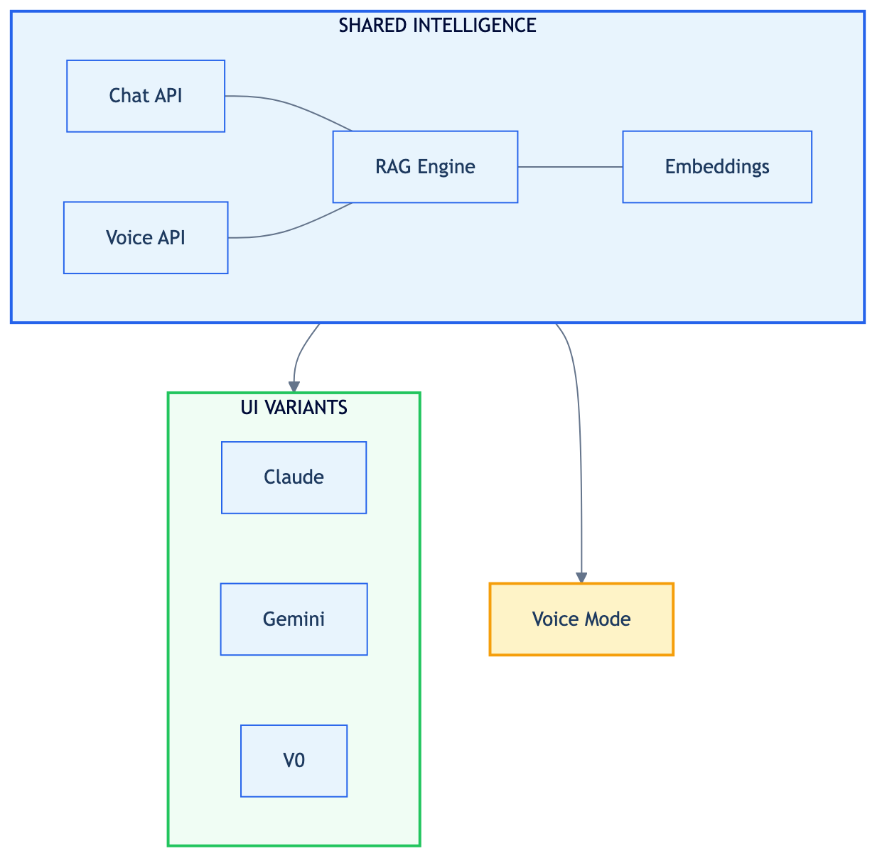
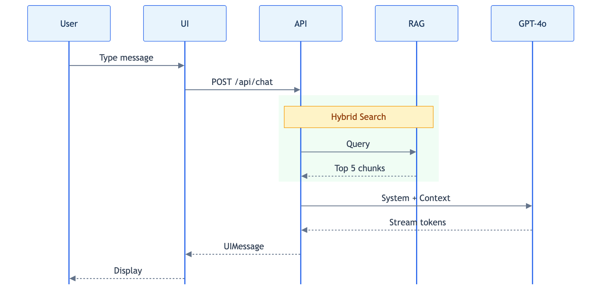
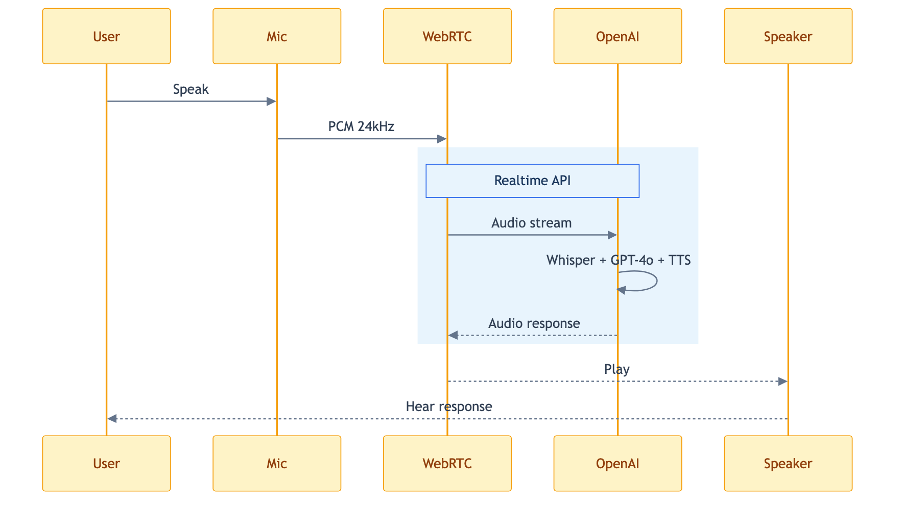
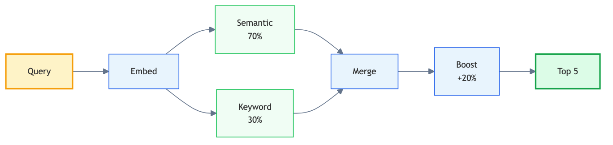
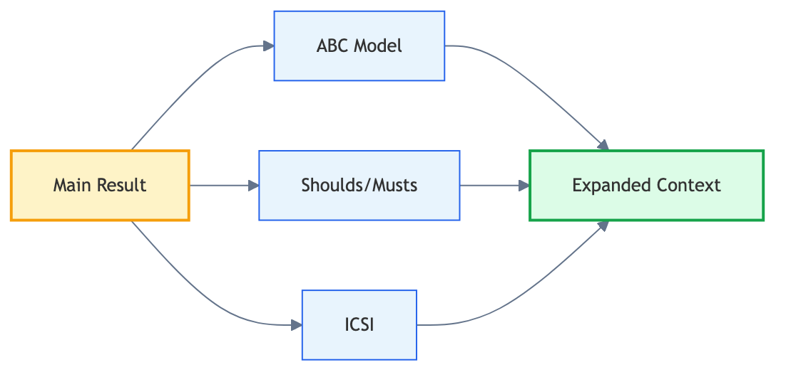
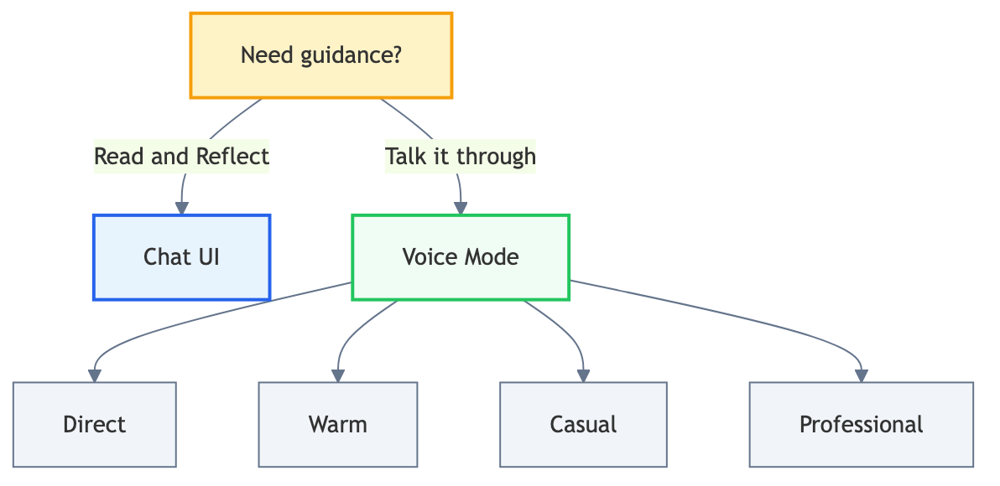

# My4Blocks

## Voice & Chat Architecture Guide

---

*Where wisdom meets conversation*

*A visual guide to how AI thinks, speaks, and understands*

---

**Version 4.0** · February 2026

## Contents

| Section | Page |
|---------|------|
| **1. Overview** | 3 |
| **2. The Knowledge Base** | 4 |
| **3. How Chat Works** | 5 |
| **4. How Voice Works** | 6 |
| **5. System Prompts** | 7 |
| **6. RAG System Deep Dive** | 8 |
| **7. Comparison** | 10 |

  

### About This Document

This guide explains the architecture behind My4Blocks — an AI-powered emotional education platform based on Dr. Vincent E. Parr's book *"You Only Have Four Problems."*

The system provides **three UI variants** (Claude, Gemini, V0) that share a common intelligence layer, plus a **real-time voice mode** for hands-free conversations.

## 1. Overview

My4Blocks provides **three UI variants** that all share the same intelligence:

**All paths lead to the same brain** — a RAG system powered by 280 chunks of wisdom from Dr. Vincent E. Parr's *"You Only Have Four Problems."*

## 2. The Knowledge Base

### Source Material

| File | Size | Purpose |
|------|------|---------|
| `you-only-have-four-problems-book-text.pdf` | 706 KB | Original book |
| `shared/data/embeddings.json` | 280 chunks | Processed wisdom |

### Chapter Distribution

| Code | Chapter | Chunks |
|------|---------|--------|
| ABC | ABCs | 87 |
| MEN | Mental Contamination | 65 |
| GEN | General | 43 |
| ANG | Anger | 36 |
| HAP | Happiness | 13 |
| IRR | Irrational Beliefs | 11 |
| HEA | Healthy Living | 10 |
| DEP | Depression | 3 |
| ANX | Anxiety | 1 |

### Chunk Structure

Each of the 280 chunks contains:

- **text** — The actual wisdom content
- **embedding** — 1536-dimensional vector (OpenAI text-embedding-3-small)
- **metadata** — Chapter, section, title, tags, keywords, related chunks

## 3. How Chat Works

### Flow Summary

1. **User** types a message in the UI
2. **API** receives `POST /api/chat` with message history
3. **RAG** performs hybrid search (70% semantic + 30% keyword)
4. **Top 5 chunks** are retrieved and formatted as context
5. **GPT-4o-mini** receives system prompt + RAG context + messages
6. **Tokens** stream back to the UI in real-time

**Key file:** `shared/api/chat.ts` — `handleChatRequest()`

## 4. How Voice Works

### Flow Summary

1. **User** speaks into microphone
2. **WebRTC** streams PCM audio (24kHz) to OpenAI
3. **Whisper** transcribes speech to text
4. **GPT-4o Realtime** processes with RAG-injected instructions
5. **TTS** converts response to speech
6. **Audio** streams back via WebRTC data channel

**Key file:** `shared/api/realtime.ts` — `createRealtimeSession()`

## 5. System Prompts

### The Four Blocks to Happiness

| Block | Description | Key Thought |
|-------|-------------|-------------|
| **Anger** | Demanding others/situations be different | *"This should not be happening"* |
| **Anxiety** | Catastrophizing about the future | *"What if the worst happens?"* |
| **Depression** | Rating your SELF as worthless | *"I am a failure"* |
| **Guilt** | Self-condemnation about actions | *"I should have done differently"* |

### The ABC Model

| Letter | Meaning |
|--------|---------|
| **A** | Activating Event — what happens |
| **B** | Belief — your thoughts about it |
| **C** | Consequence — your emotional response |

> *"Events don't cause emotions; BELIEFS do!"*

### Voice Style Options

| Style | Description |
|-------|-------------|
| **Direct** | Skip filler. Give insight, then discuss. |
| **Warm** | Acknowledge feelings briefly, then explore. |
| **Casual** | Everyday language, skip jargon. |
| **Professional** | Clear, efficient, actionable insights. |

## 6. RAG System Deep Dive

### Hybrid Search Pipeline

### Algorithm Steps

| Step | Process | Details |
|------|---------|---------|
| **1** | Embed Query | OpenAI text-embedding-3-small → 1536 dimensions |
| **2a** | Semantic Search | Cosine similarity between query and chunk embeddings |
| **2b** | Keyword Search | TF-IDF with emotion boosting and word expansion |
| **3** | Merge Scores | `hybrid = (semantic × 0.7) + (keyword × 0.3)` |
| **4** | Emotion Boost | +20% if chunk's emotion type matches detected emotion |
| **5** | Return Top K | Default: 5 chunks |

### Keyword Search Features

| Feature | Description |
|---------|-------------|
| Stopwords Filter | Removes "the", "a", "an", etc. |
| Emotion Boosting | Anger/anxiety/depression terms get 2× weight |
| Word Expansion | "angry" also matches "anger", "angered" |
| Synonym Matching | "sad" matches "depressed", "unhappy" |

### Graph Expansion (Optional)

When enabled, the system follows "related" links between chunks to provide broader context and more connections between concepts.

## 7. Comparison

### Chat vs Voice

| Feature | Chat | Voice |
|---------|------|-------|
| **UI** | Claude, Gemini, V0 | WebRTC orb |
| **Input** | Text | Speech (Whisper-1) |
| **Output** | Streaming text | Speech + transcript |
| **Model** | gpt-4o-mini | gpt-4o-realtime-preview |
| **RAG** | 280 chunks | 280 chunks |
| **Prompt** | Full book knowledge | Condensed for voice |
| **Styles** | Fixed | 4 options |
| **Voices** | — | 9 options |
| **Latency** | Streaming | Realtime (lower) |
| **Best For** | Reading, reflection | Hands-free |

### When to Use What

---

**My4Blocks** — Emotional Education Through AI

*Based on "You Only Have Four Problems" by Dr. Vincent E. Parr, Ph.D.*

