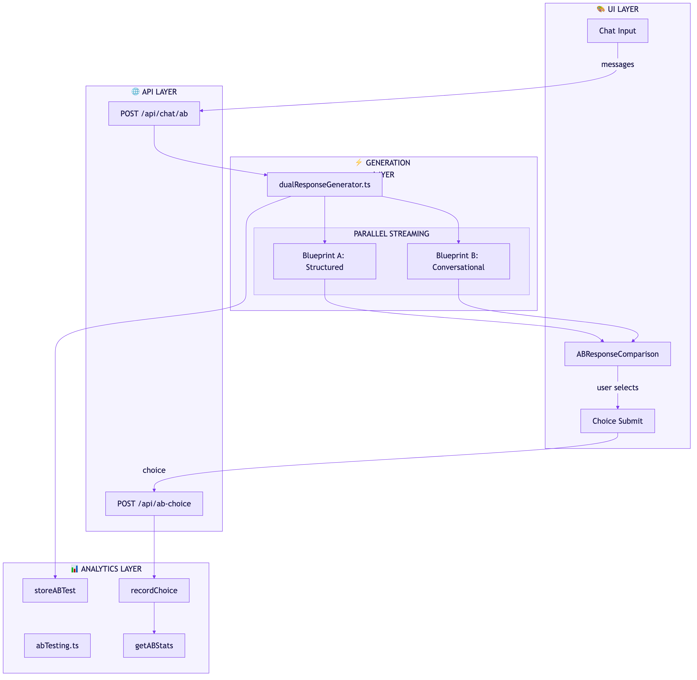
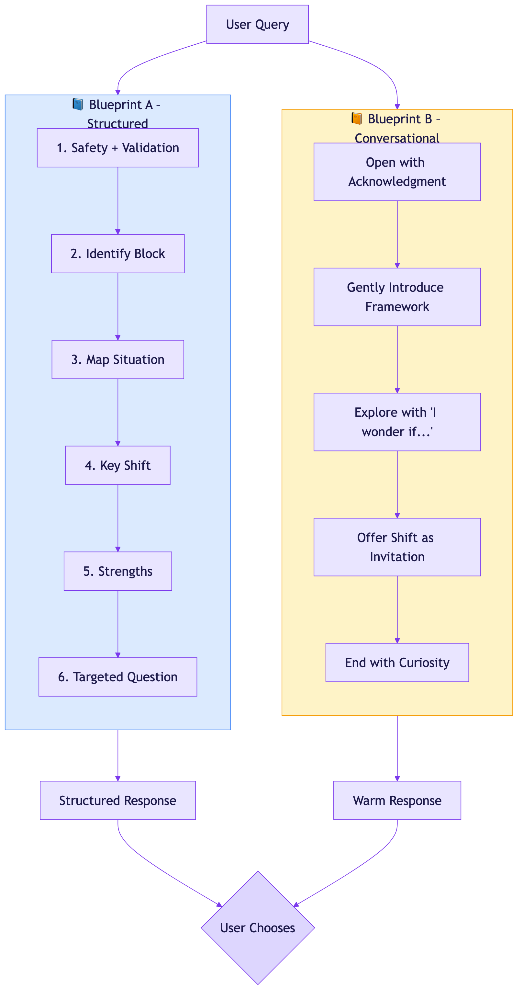
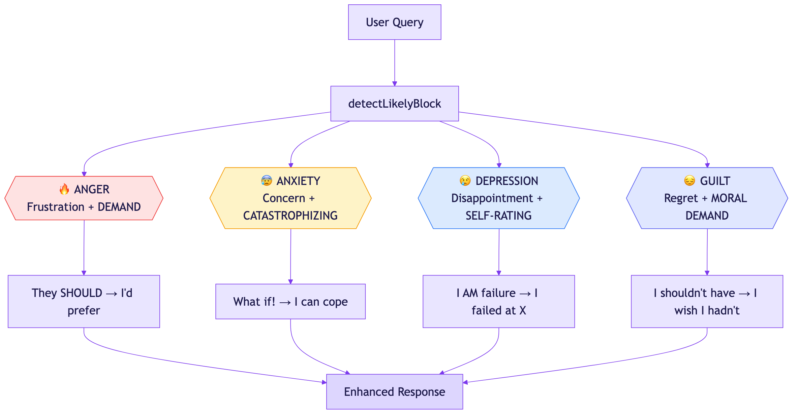
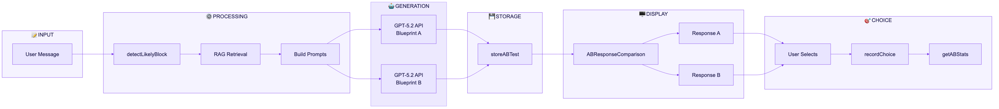

# Response Blueprints & A/B Testing Architecture

**Technical Documentation for My 4 Blocks**

*"Two paths diverge in the digital wood, and we shall test them both, for science!"*

A comprehensive guide to the dual-response A/B testing system built on the Four Blocks framework by Dr. Vincent E. Parr.

**Version 1.0** - February 2025

---

## Table of Contents

1. Executive Summary
2. System Architecture
3. Response Blueprints
4. The Four Blocks Framework
5. Emotion Detection
6. A/B Testing Infrastructure
7. API Endpoints
8. Data Flow
9. Analytics

---

## 1. Executive Summary

The My 4 Blocks A/B Testing system enables scientific comparison of two distinct response styles for emotional guidance. Built on Dr. Vincent E. Parr's Four Blocks framework, this system generates parallel AI responses using different blueprints and collects user preferences to optimize therapeutic effectiveness.

### Key Features

- **Dual Response Generation**: Parallel streaming of Blueprint A (structured) and Blueprint B (conversational)
- **Position Bias Mitigation**: Random ordering prevents first-option preference skewing
- **Emotion Detection**: Regex-based pattern matching to identify the relevant Four Block
- **In-Memory Analytics**: FIFO storage with 100-entry capacity for A/B test results
- **Real-Time Streaming**: Both responses stream simultaneously via OpenAI SDK

### System Specifications

| Component | Specification |
|-----------|---------------|
| Model | gpt-5.2 (latest) |
| Temperature | 0.7 (balanced creativity) |
| Max Tokens | 2,000 per response |
| Storage Limit | 100 A/B test entries (FIFO) |
| Detection Patterns | 4 blocks × 8+ regex patterns each |

---

## 2. System Architecture

The A/B Testing architecture is a modular system with four layers: UI Layer, API Layer, Generation Layer, and Analytics Layer. The system generates two parallel responses using different blueprints and tracks user preferences.

### Architecture Layers

| Layer | Components | Description |
|-------|-----------|-------------|
| UI Layer | Chat Input, ABComparison | User interface for input and selection |
| API Layer | /api/chat/ab, /api/ab-choice | REST endpoints for generation and recording |
| Generation | dualResponseGenerator.ts | Parallel Blueprint A + B streaming |
| Analytics | abTesting.ts | FIFO storage and statistics |

---

## 3. Response Blueprints

Response Blueprints define the structural and tonal approach for AI-generated guidance. Two distinct blueprints enable scientific comparison of effectiveness.

### 3.1 Blueprint A: Structured Guidance

A methodical 6-step protocol for clear, direct guidance:

| Step | Purpose | Content |
|------|---------|---------|
| 1. Safety + Validation | Build trust | Acknowledge without minimizing |
| 2. Identify Block | Diagnose | Name the Four Block and formula |
| 3. Map Situation | Personalize | Use THEIR words; show ABC mapping |
| 4. Key Shift | Intervene | MUST to Preference transformation |
| 5. Strengths | Empower | Connect pain to values |
| 6. Question | Engage | One targeted question |

### 3.2 Blueprint B: Conversational Guidance

Blueprint B uses a fluid, exploratory approach that feels like conversation with a wise friend. Uses "I wonder if..." language to invite discovery rather than prescribe solutions.

| Aspect | Blueprint A | Blueprint B |
|--------|------------|------------|
| Tone | Direct, methodical | Warm, exploratory |
| Structure | Rigid 6-step protocol | Fluid, adaptive |
| Language | "Here's the formula..." | "I wonder if..." |
| Framework | Explicitly stated | Gently woven in |
| Best For | Users wanting clarity | Users wanting connection |

---

## 4. The Four Blocks Framework

The Four Blocks framework identifies four fundamental emotional patterns that cause human suffering. Each block has a distinct formula and requires a specific intervention.

### Block Formulas

| Block | Formula |
|-------|---------|
| ANGER | Frustration + DEMAND = Anger |
| ANXIETY | Concern + CATASTROPHIZING = Anxiety |
| DEPRESSION | Disappointment + SELF-RATING = Depression |
| GUILT | Regret + MORAL DEMAND = Guilt |

### Key Shifts

| Block | Core Belief | Key Shift |
|-------|------------|-----------|
| ANGER | Others MUST be different | "They SHOULD" → "I'd prefer" |
| ANXIETY | Bad things MUST NOT happen | "What if!" → "I can cope" |
| DEPRESSION | I MUST be worthy (identity) | "I AM failure" → "I failed at X" |
| GUILT | I MUST NOT have done that | "I shouldn't have" → "I wish" |

### Critical: Depression vs Guilt

**DEPRESSION** attacks *WHO you ARE* ("I am worthless") - rates the entire self.

**GUILT** attacks *WHAT you DID* ("I shouldn't have done that") - rates the action.

*Different cure: Depression needs "You're not your failures." Guilt needs "You're allowed to be fallible."*

---

## 5. Emotion Detection System

The emotion detection system uses regex pattern matching to identify which of the Four Blocks the user is likely experiencing. This enables personalized responses.

### Detection Algorithm

The `detectLikelyBlock()` function checks patterns in order of specificity:

1. **Depression patterns** (most specific - global self-rating)
2. **Guilt patterns** (action-focused regret)
3. **Anxiety patterns** (future catastrophizing)
4. **Anger patterns** (demands on others/situations)

If no pattern matches, returns null to let the AI decide.

### Pattern Examples

| Block | Pattern Example | Sample Trigger |
|-------|-----------------|----------------|
| Depression | `/i am (a )?failure/` | "I'm such a loser" |
| Guilt | `/i should not have/` | "I shouldn't have said that" |
| Anxiety | `/what if/` | "What if it goes wrong?" |
| Anger | `/(they\|he\|she) should/` | "He shouldn't treat me this way" |

---

## 6. A/B Testing Infrastructure

### 6.1 Storage System

The A/B testing storage uses in-memory FIFO eviction to maintain a rolling window of test results for development and initial analysis.

- **MAX_ENTRIES**: 100 test entries (configurable)
- **FIFO Eviction**: Oldest entries removed when at capacity
- **Unique IDs**: timestamp + random suffix (e.g., `ab_lx3k2p_7f9m2`)
- **Metadata**: model, temperature, detected block, response times

### ABTestEntry Structure

| Field | Type | Description |
|-------|------|-------------|
| id | string | Unique test identifier |
| timestamp | string | ISO timestamp |
| userQuery | string | Original user message |
| responseA | string | Blueprint A response |
| responseB | string | Blueprint B response |
| userChoice | 'A' \| 'B' \| null | User's preference |
| metadata.modelA | string? | Model used for A |
| metadata.detectedBlock | string? | Detected Four Block |

### 6.2 Dual Response Generator

The generation flow:

1. `prepareDualGeneration()` builds system prompts for both A and B
2. PARALLEL: Two GPT-5.2 API calls launched simultaneously
3. Stream chunks delivered to UI as they arrive
4. `createDualResponseResult()` assembles final result with timing
5. `storeABTest()` saves to in-memory storage with unique ID

---

## 7. API Endpoints

| Endpoint | Method | Purpose |
|----------|--------|---------|
| POST /api/chat/ab | POST | Generate dual A/B responses |
| POST /api/ab-choice | POST | Record user's choice |
| GET /api/ab-choice | GET | Get A/B test statistics |

### POST /api/chat/ab Response

| Field | Example Value |
|-------|---------------|
| abTestId | "ab_lx3k2p_7f9m2" |
| responseA | "What you're experiencing makes sense..." |
| responseB | "Oh man, that sounds rough..." |
| context.detectedBlock | "Anger" |

---

## 8. Data Flow

The complete data flow from user input to analytics shows how the system processes queries, generates dual responses, and tracks preferences.

### Flow Steps

| Step | Component | Action |
|------|-----------|--------|
| 1 | User | Types message in Chat Input |
| 2 | Client | POST /api/chat/ab with messages |
| 3 | Server | detectLikelyBlock(userQuery) |
| 4 | RAG | findRelevantWisdom(query, 5) |
| 5 | Prompts | buildEnhancedSystemPrompt A + B |
| 6 | GPT-5.2 | PARALLEL streaming both blueprints |
| 7 | Storage | storeABTest() with unique ID |
| 8 | UI | ABResponseComparison displays both |
| 9 | User | Clicks 'Choose This' |
| 10 | Analytics | recordChoice() and getABStats() |

---

## 9. Analytics and Metrics

### Key Metrics

| Metric | Description | API Function |
|--------|-------------|--------------|
| Total Tests | Number of A/B tests conducted | `getABStats().total` |
| With Choice | Tests where user made selection | `getABStats().withChoice` |
| A Win Rate | Percentage choosing Blueprint A | `getABStats().aWinRate` |
| B Win Rate | Percentage choosing Blueprint B | `getABStats().bWinRate` |
| No Choice | Tests abandoned | `getABStats().noChoice` |

### Sample Statistics Response

| Field | Value | Description |
|-------|-------|-------------|
| total | 87 | Total A/B tests |
| withChoice | 72 | Tests with selection |
| aWins | 31 | Blueprint A chosen |
| bWins | 41 | Blueprint B chosen |
| aWinRate | 43.1% | A win percentage |
| bWinRate | 56.9% | B win percentage |

### Future Enhancements

- Persistent storage (PostgreSQL/Redis) for long-term analytics
- Time-series analysis of preference trends
- Statistical significance testing
- User cohort analysis

---

**Generated:** February 13, 2025
**My 4 Blocks - A/B Testing Architecture Documentation**
